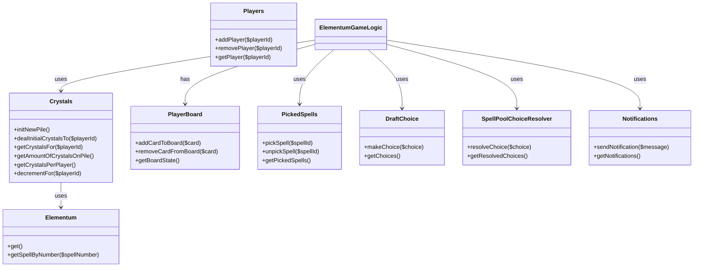

```mermaid
classDiagram
    class Crystals {
        +initNewPile()
        +dealInitialCrystalsTo($playerId)
        +getCrystalsFor($playerId)
        +getAmountOfCrystalsOnPile()
        +getCrystalsPerPlayer()
        +decrementFor($playerId)
    }

    class Players {
        +addPlayer($playerId)
        +removePlayer($playerId)
        +getPlayer($playerId)
    }

    class PlayerBoard {
        +addCardToBoard($card)
        +removeCardFromBoard($card)
        +getBoardState()
    }

    class PickedSpells {
        +pickSpell($spellId)
        +unpickSpell($spellId)
        +getPickedSpells()
    }

    class DraftChoice {
        +makeChoice($choice)
        +getChoices()
    }

    class SpellPoolChoiceResolver {
        +resolveChoice($choice)
        +getResolvedChoices()
    }

    class Notifications {
        +sendNotification($message)
        +getNotifications()
    }

    class Elementum {
        +get()
        +getSpellByNumber($spellNumber)
    }

    Crystals --> Elementum : uses
    ElementumGameLogic --> Crystals : uses
    ElementumGameLogic --> PlayerBoard : has
    ElementumGameLogic --> PickedSpells : uses
    ElementumGameLogic --> DraftChoice : uses
    ElementumGameLogic --> SpellPoolChoiceResolver : uses
    ElementumGameLogic --> Notifications : uses
```
