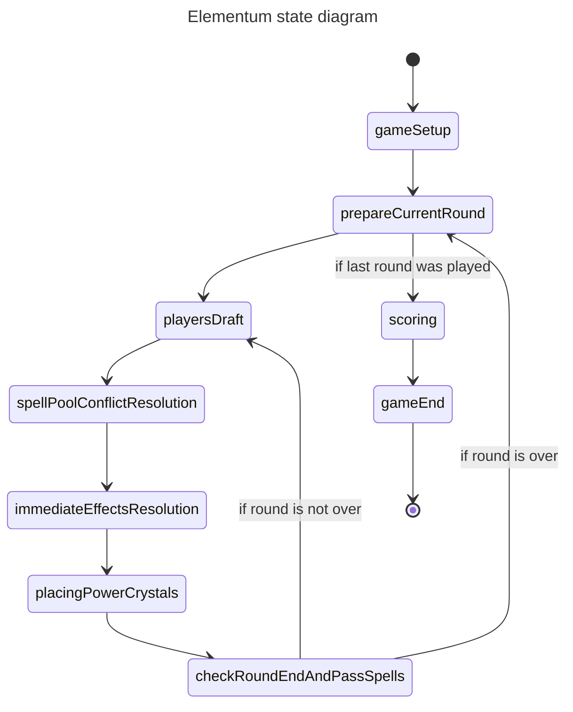
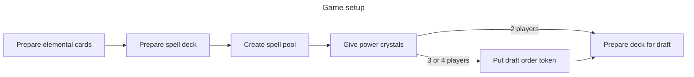
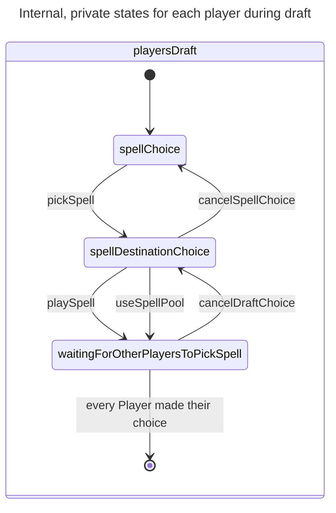

# General state diagram

Need to confirm if immediate effects and power crystals placement happens before or after Spell 53 is played. Does it happen twice if this Spell is played, once for each played Spell? Or only once, after two spells are played? Can both Spells be replaced in Spell pool? Can one be played regularly and other be used to replace a Spell in Spell pool?

## Game setup

## Player draft

Each player goes through the following states privately, in parallel, independent of other players.

Required params:

| Transition   | Params                                                           |
| ------------ | ---------------------------------------------------------------- |
| pickSpell    | Spell number                                                     |
| playSpell    | -                                                                |
| useSpellPool | Spell number from Spell Pool to replace it with the picked Spell |

It must be evident in the UI if current draft comes from playing Spell 53, which allows to pick two Spells, but `playersDraft` shouldn't be aware of it, because it doesn't change the behavior of the draft, it's just some UI thing. So there are no extra arguments in this state or any of the internal states
